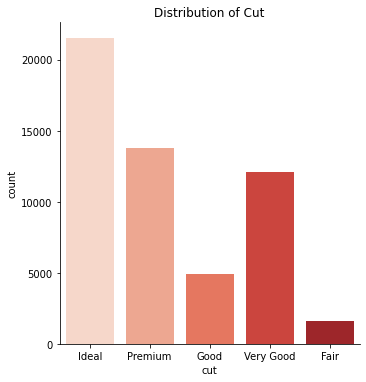
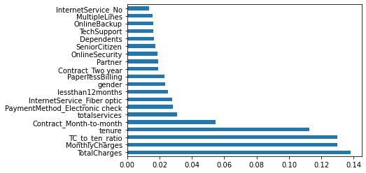
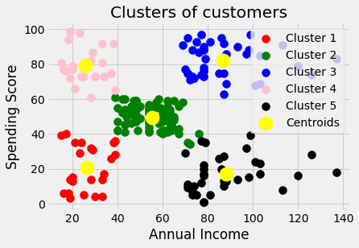
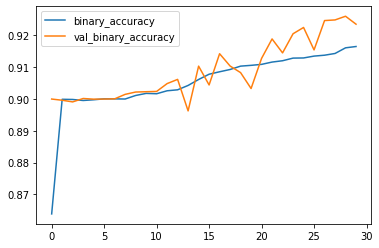

# Erik Ferrari's Data Science Portfolio

## [Project 1: Diamond Price Predictor](https://github.com/eferrari421/Diamond-Price-Prediction)
- Created a tool that estimates the price of a  given diamond 
- Engineered two new features, volume and ratio, from the given features
- Optimized a Random Forest regressor using GridSearchCV to reach the model

## [Project 2: Telco Customer Churn Predictor](https://github.com/eferrari421/Telco-Customer-Churn-Prediction)
- Developed a classifier that predicts whether or not a customer will churn from Telco
- Added three new features to the predictors, one of which (total cost to tenure ratio) proved to be the third most important feature in prediction
- Optimized a Naive Bayes classifier using GridSearchCV to reach the final model with an accuracy of 76.8%

## [Project 3: Mall Customers Clustering](https://github.com/eferrari421/Mall-Customers-Clustering)
- Grouped mall customers into clusters using three different combinations of customer metrics
- Created visualisations of the created clusters

## [Project 4: Kelley Blue Book Reviews Scraper](https://github.com/eferrari421/Kelley-Blue-Book-Reviews-Web-Scraper)
- Utilized pandas, numpy, time, requests, and BeautifulSoup
- Scraped the first five review pages of all sedans off Kelley Blue Book
- Data scraped included product name, review id, number of thumbs up, number of thumbs down, headline of review, actual review, pros, and cons
- Converted data into a dataframe that can be used for a project

## [Project 5: Cifar Image Classification](https://github.com/eferrari421/Cifar-Image-Classification)
- Created a custom convolution neural network that classified the images given in the dataset into ten different categories
- Classified the test images with 92.36% accuracy

